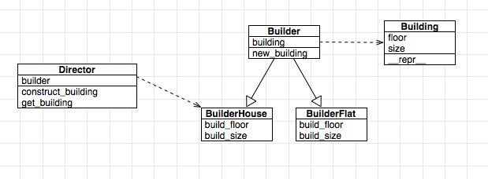

# Python设计模式

代码直戳: https://github.com/faif/python-patterns

# 创建型模式

## 工厂方法

实例 -> 类 -> 类工厂

## 抽象工厂

简单来说就是把一些具有相同方法的类再进行封装,抽象共同的方法以供调用.是工厂方法的进阶版本.

实例 -> 类 -> 类工厂 -> 抽象工厂

## 惰性初始化 Lazy evaluation

这个Python里可以使用@property实现,就是当调用的时候才生成.

## 生成器 Builder

Builder模式主要用于构建一个复杂的对象，但这个对象构建的算法是稳定的，对象中的各个部分经常变化。Builder模式主要在于应对复杂对象各个部分的频繁需求变动。但是难以应对算法的需求变动。这点一定要注意，如果用错了，会带来很多不必要的麻烦。

重点是将复杂对象的建造过程抽象出来（抽象类别），使这个抽象过程的不同实现方法可以构造出不同表现（属性）的对象。

简单的说：子对象变化较频繁，对算法相对稳定。

## 单例模式 Singleton

一个类只有一个实例

## 原型模式

特点是通过复制一个已经存在的实例来返回新的实例,而不是新建实例.

多用于创建复杂的或者耗时的实例,因为这种情况下,复制一个已经存在的实例使程序运行更高效;或者创建值相等,只是命名不一样的同类数据.

## 对象池 Object pool

一个对象池是一组已经初始化过且可以使用的对象，而可以不用在有需求时创建和销毁对象。池的用户可以从池子中取得对象，对其进行操作处理，并在不需要时归还给池子而非销毁 而不是销毁它. 

在Python内部实现了对象池技术.例如像小整型这样的数据引用非常多,创建销毁都会消耗时间,所以保存在对象池里,减少开销.

# 结构型模式

## 修饰模型 Decorator

Python里就是装饰器.

## 代理模式 Proxy

例如Python里的引用计数.

# 行为型模式

## 迭代器 

迭代容器里所有的元素.

